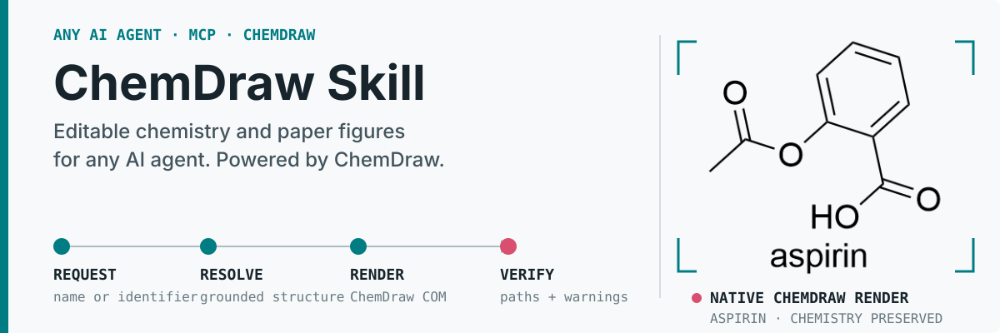
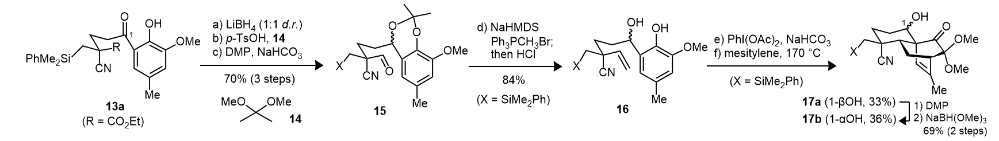

# ChemDraw Skill

<p align="center">
  
</p>

Turn chemistry requests into editable CDXML, native ChemDraw renders, molecule comparisons, recognition candidates, and Office-embedded structures through a client-independent Skill and MCP server.

<p align="center">
  <a href="README.zh-cn.md"></a>&nbsp;
  <a href="docs/guide.md#first-time-windows-setup"></a>&nbsp;
  <a href="skill/chemdraw/references/workflow-router.md"></a>&nbsp;
  <a href=".github/SECURITY.md"></a>
</p>

<p align="center">
  <a href="https://github.com/ZiChenWang114514/chemdraw-skill/actions/workflows/validate.yml"></a>&nbsp;
  &nbsp;
  &nbsp;
  &nbsp;
  <a href="LICENSE"></a>
</p>

## Reproduce a paper figure

Start with the whole figure, then follow one route:

**Inspect → crop structures → DECIMER → match orientation → inspect side-by-side → correct chemistry → assemble conditions and layout → native preview.**

```text
Use the ChemDraw Skill to reproduce this paper figure. Read the whole scheme,
crop each complete structure, and obtain DECIMER candidates. Match the original
orientation, inspect actual side-by-side previews, and correct only the affected
structures. Transcribe conditions visually, then deliver editable CDXML and a
native preview with unresolved chemistry or visual differences stated clearly.
```

### From a paper screenshot to editable ChemDraw

**A worked reproduction of the supplied synthesis-scheme excerpt.** The agent segmented the figure, used DECIMER API recognition, redrew in ChemDraw, inspected side-by-side comparisons, corrected structures, and assembled visually transcribed conditions.

**Original paper excerpt — supplied by the user**


**Editable reconstruction — ChemDraw-native output**



[Download editable CDXML](assets/readme/paper-replica/replica.cdxml) · [Inspect structure-by-structure comparisons](assets/readme/paper-replica/structure-comparison.png) · [Case provenance](assets/readme/paper-replica/provenance.json)

Review corrected OH/CH₃ and OMe/OH recognition errors, restored X/R abbreviations, and removed an unsupported configuration at a wavy bond. All five corrected structures passed final-CDXML readback in this case; 17a/17b retain the source's shared wavy-bond representation.

**Visually reviewed and editable; not pixel-identical.** Font metrics, arrows and some line geometry still differ. Chemical readback agreement does not establish absolute recognition accuracy.

[Fast replication guide](skill/chemdraw/references/image-visual-review.md) · [Minimal task template](skill/chemdraw/assets/paper-replica/task-template.json) · [Self-authored drawing fixture](skill/chemdraw/assets/paper-replica/example/CASE.md)

| Need | Ready-to-use route |
| --- | --- |
| Crop and review an image | Existing crop/mask and comparison helpers; keep region-to-result mapping |
| Match a folded chain or bridged ring | Trace source coordinates, then check crossings and bond order |
| Correct stereochemistry | Inspect atom indices, apply an explicit edit, and read back final CDXML |
| Assemble the final scheme | Fixed-coordinate figures, rich conditions, arrows and native preview |
| Work beyond drawing | RDKit stereo/tautomer enumeration, MCS and R-group decomposition |

Remote DECIMER calls require upload authorization. Visual review remains an agent task; pixel metrics do not certify chemistry or universal 1:1 fidelity.

## What It Handles

- **Structures and reactions:** resolve names and identifiers; draw, edit, clean, merge, polish, segment, convert, and render CDXML or CDX documents.
- **Molecule comparison:** use ChemScript exact-identity checks together with RDKit fingerprint similarity for one molecule pair or a bounded batch.
- **Image recognition:** extract candidate structures, confidence values, and bounding boxes with local DECIMER models or an explicitly confirmed remote request. Recognition candidates still require source review.
- **Office documents:** embed editable ChemDraw objects in supported desktop versions of Word and PowerPoint.
- **Experimental records:** discover files and process selected LCMS, SciFinder RDF, and lab-book workflows.
- **ChemScript SDK:** inspect the installed public catalog and run supported declarative calls in a separate worker process. Process separation limits stalled calls; it is not an operating-system security sandbox.
- **Remote workstation access:** keep stdio as the default or expose the Windows host through optional Streamable HTTP with health and Prometheus endpoints.

The project audits 594 public `cdxml-toolkit-community` symbols. That number describes the toolkit inventory, not the 38-tool full MCP profile. Full public ChemScript catalog coverage means the interface can be discovered and reported; successful execution still depends on the installed SDK, license, architecture, and individual member behavior.

## Choose the Required Components

| Goal | Add to the core setup |
| --- | --- |
| Create and edit CDXML | Any agent, 64-bit Python 3.10-3.13, MCP 1.x or 2.x, and `cdxml-toolkit-community` at the commit pinned in Quick Start; runs on Windows, macOS, and Linux |
| Native PNG, CDX, or ChemDraw cleanup | Licensed and activated Windows desktop ChemDraw with working COM automation |
| Molecule comparison or ChemScript SDK calls | Installed ChemScript DLLs compatible with the selected worker runtime |
| Editable Word or PowerPoint objects | Supported desktop Microsoft Word and/or PowerPoint |
| Local optical structure recognition | DECIMER model weights and their runtime dependencies |
| Remote access to a ChemDraw workstation | A Windows host plus authenticated HTTP configuration and an encrypted network path |

ChemDraw, Microsoft Office, ChemScript, and DECIMER model weights are not bundled. For a first installation, use the [step-by-step Chinese guide](docs/zh-cn.md#从零开始安装) or the [detailed English guide](docs/guide.md#first-time-windows-setup).

## Quick Start: any agent

Load `skill/chemdraw/SKILL.md` in your agent, then connect MCP or use Python/CLI. Clients with Skill discovery can install the whole `chemdraw` folder in their own Skill directory. Otherwise, point the agent's project instructions to the file.

```powershell
git clone https://github.com/ZiChenWang114514/chemdraw-skill.git
Set-Location .\chemdraw-skill
python -m pip install "cdxml-toolkit-community @ git+https://github.com/ZiChenWang114514/cdxml-toolkit-community.git@57db286ea4fa1c74a524e7a329dd5ba3f39dc21e"
python -m cdxml_toolkit.mcp_runtime
```

This starts a stdio server with the full 38-tool collection. Register the same absolute Python executable and arguments in your client's MCP settings. Image reconstruction needs vision or human visual review.

On Windows, preview `scripts/install.ps1 -Destination <your-skill-directory>`, then add `-Apply`. Its default storage path is `$HOME/.agents/skills/chemdraw`; individual clients may use different discovery paths. Client configuration is not changed by default. On macOS/Linux, copy the entire Skill folder directly.

[Generic MCP, CLI and optional client adapters](skill/chemdraw/references/agent-integration.md) · [Windows native setup](docs/guide.md#first-time-windows-setup) · [Chinese walkthrough](docs/zh-cn.md)

```powershell
# Generic health check; no particular agent CLI or native application required
.\skill\chemdraw\scripts\health_check.ps1 -Python <absolute-python-path> -SkipNativeChemDraw
```

For native rendering, ChemScript or Office, add the corresponding dependencies and select the checks described in the setup guide.

## Validation and Safety

- GitHub Actions validates the portable runtime on Windows and Linux with Python 3.12, MCP 1.28.1 and 2.0.0, and `cdxml-toolkit-community` at the commit pinned in Quick Start. Python 3.10-3.13 is supported.
- Native ChemDraw, ChemScript, and Office behavior must be checked on a licensed local Windows host because those applications are unavailable in hosted CI.
- Structural changes can be checked with source identity, MCS-based diffs, chemistry metadata, and native rendering. Scientific acceptance remains the user's responsibility.
- Standard modifying tools create a new output path and reject accidental replacement. ChemScript SDK file access and replacement are available only when their explicit permission and overwrite options are enabled.
- Remote image recognition refuses upload unless the caller explicitly confirms it. The guided replication route requires explicit structure-role assignment and visual review; it is not an unattended reaction-image converter.
- The built-in HTTP listener does not provide TLS. Non-loopback use requires bearer authentication and an allowed `Host`; place it behind an encrypted tunnel or HTTPS reverse proxy. `/health` exposes status only, while `/metrics` requires authentication.
- Worker processes provide timeout and failure isolation, but they do not sandbox ChemDraw, Office, Python dependencies, or filesystem access. Review the [security policy](.github/SECURITY.md) before enabling native file operations or remote access.

## Documentation

- [Chinese setup and first use](docs/zh-cn.md)
- [Installation, troubleshooting, architecture, and operations](docs/guide.md)
- [Task-oriented workflow catalog](skill/chemdraw/references/workflow-router.md)
- [Generated MCP tool signatures](skill/chemdraw/references/mcp-signatures.md)
- [Audited `cdxml-toolkit-community` public inventory](skill/chemdraw/references/toolkit-public-inventory.md)
- [Streamable HTTP setup](docs/guide.md#streamable-http)
- [Contributing guide](.github/contributing.md)
- [Security policy](.github/SECURITY.md)

The deployable Skill lives in [`skill/chemdraw`](skill/chemdraw). Repository-specific contributor instructions are in [`AGENTS.md`](AGENTS.md).

## License

Repository-authored code and documentation are licensed under the [MIT License](LICENSE). ChemDraw, Microsoft Office, agent clients, `cdxml-toolkit-community`, the MCP Python SDK, RDKit, DECIMER, and their dependencies retain their respective licenses and usage terms.

This is an independent community project. It is not affiliated with or endorsed by Revvity, OpenAI, Microsoft, or the maintainers of the upstream `cdxml-toolkit`, the MCP Python SDK, RDKit, or DECIMER.
