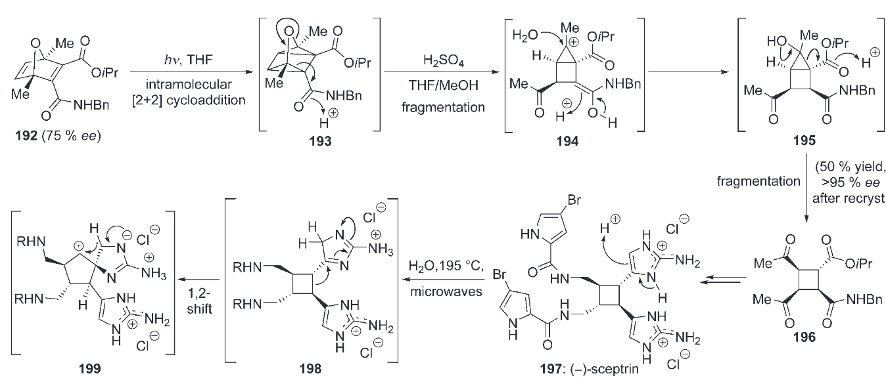
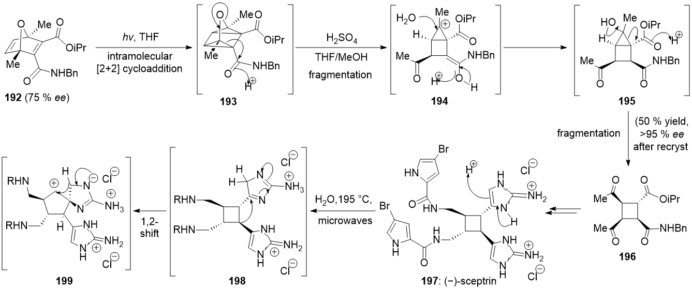
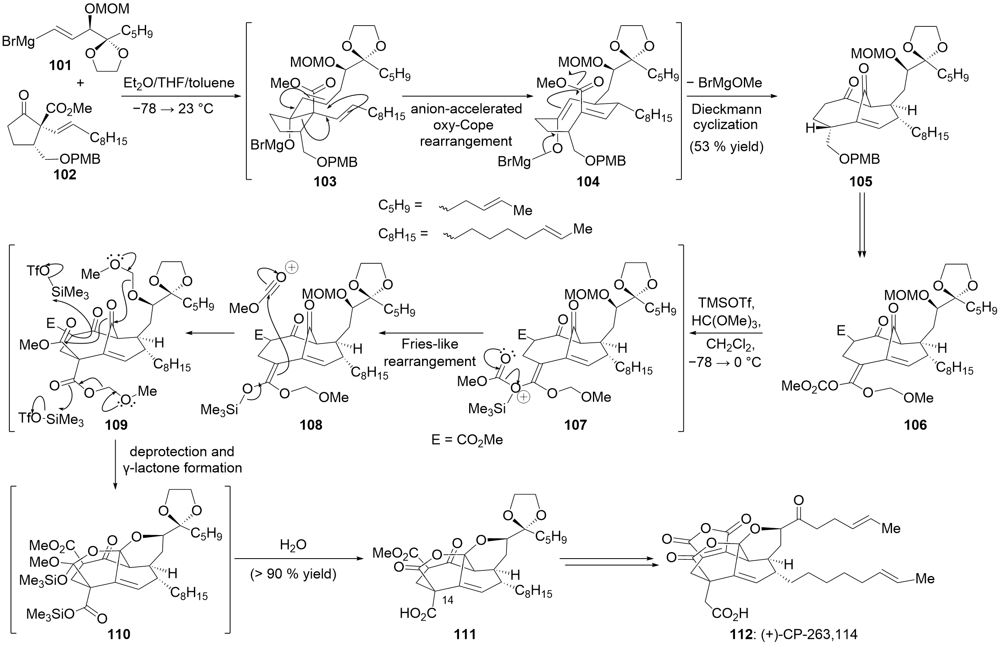

# ChemDraw Skill

<p align="center">
  
</p>

通过一个通用 Agent Skill 和 MCP 服务器，将化学请求转化为可编辑 CDXML、ChemDraw 原生渲染结果、分子比较结果、识别候选结构以及嵌入 Office 的化学结构。

<p align="center">
  <a href="README.md"></a>&nbsp;
  <a href="docs/guide.zh-cn.md#首次-windows-安装"></a>&nbsp;
  <a href="skill/chemdraw/references/workflow-router.md"></a>&nbsp;
  <a href=".github/SECURITY.md"></a>
</p>

<p align="center">
  <a href="https://github.com/ZiChenWang114514/chemdraw-skill/actions/workflows/validate.yml"></a>&nbsp;
  &nbsp;
  &nbsp;
  &nbsp;
  <a href="LICENSE"></a>
</p>

<p align="center"><a href="#主打案例">查看主打案例</a> · <a href="#快速开始任意-agent">快速开始</a></p>

## 主打案例

从实际图片和数据出发，直接查看效果、原图对照和可编辑文件。

| 案例 | 展示内容 | 交付范围 |
| --- | --- | --- |
| [论文反应路线](#paper-scheme-demo) | 五个结构、条件、产率与波浪键 | 完整复刻，非像素一致 |
| [Sceptrin 反应机理](#mechanism-demo) | 八个结构、电子箭头、电荷与条件 | 完整复刻，非像素一致 |
| [原生 TLC](#tlc-demo) | 可编辑泳道、斑点与 Rf | 可运行示例 |
| [原生装置图](#apparatus-demo) | 原生 ChemDraw 模板组装 | 可运行示例 |
| [实验 NMR 谱图](#nmr-demo) | 真实一维数据与可编辑谱图 | 可运行示例 |
| [模拟反应动力学](#kinetics-demo) | 数值数据转为可编辑曲线 | 可运行示例 |
| [复杂合成：101–112](#synthesis-101-demo) | 完整原生路线图与机理箭头 | 立体化学待完整验收；非 1:1 |
| [复杂合成：113–122](#synthesis-113-demo) | 完整原生路线图与机理箭头 | 立体化学待完整验收；非 1:1 |

<a id="paper-scheme-demo"></a>

### 论文反应路线

**将论文反应图转为可编辑的 ChemDraw 文档。** 示例保留了原图中的五个结构、反应条件、产率和化合物编号。

**论文原图**


**可编辑复刻｜ChemDraw 原生输出**


[下载可编辑 CDXML](assets/readme/paper-replica/replica.cdxml) · [查看逐结构左右对照](assets/readme/paper-replica/structure-comparison.png) · [案例来源与验证范围](assets/readme/paper-replica/provenance.json)

从保存的 CDXML 中重新解析出的五个结构，与经核对的参考结构一致。17a/17b 共用的波浪键保留原图中未指定构型的表示。

**经过视觉复核，可继续编辑；尚非逐像素 1:1。** 字体、箭头和部分线条几何仍有差异。保存前后的结构一致，并不能独立证明图中所有细节都识别正确。

<a id="mechanism-demo"></a>

### Sceptrin 反应机理

**原始截图**



**ChemDraw 重绘**



[可编辑 CDXML](assets/readme/mechanism/mechanism.cdxml) · [原生 CDX](assets/readme/mechanism/mechanism.cdx) · [左右对照](assets/readme/mechanism/comparison.png) · [验证与原图限制](assets/readme/mechanism/provenance.json)

八个编号结构和六个氯离子经过实际 ChemDraw CDXML → CDX → CDXML 保存后，分子组成、图示立体化学和形式电荷保持一致。未定义的 R 保留为通用取代基。已进行视觉核对，**并非逐像素一致**：字体、电子箭头路径、部分桥键几何以及离域电荷标记位置仍有差异；未推测补全原图被裁掉的重结晶说明。

<a id="tlc-demo"></a>

### 原生 TLC

原生 TLC 板、泳道和斑点，Rf 数值为示例。


[可编辑 CDXML](assets/readme/scientific/tlc.cdxml) · [运行示例](skill/chemdraw/references/scientific-workflows.md) · [数据与模板来源](assets/readme/scientific/provenance.json)

<a id="apparatus-demo"></a>

### 原生装置图

由 ChemDraw 自带装置模板组装，保留原生可编辑图形。


[可编辑 CDXML](assets/readme/scientific/apparatus.cdxml) · [运行示例](skill/chemdraw/references/scientific-workflows.md) · [数据与模板来源](assets/readme/scientific/provenance.json)

<a id="nmr-demo"></a>

### 实验 NMR 谱图

真实已处理的一维 NMR 数据；支持寻峰和指定区间积分，未进行自动原子归属。


[可编辑 CDXML](assets/readme/scientific/nmr.cdxml) · [运行示例](skill/chemdraw/references/scientific-workflows.md) · [数据与模板来源](assets/readme/scientific/provenance.json)

<a id="kinetics-demo"></a>

### 模拟反应动力学

明确标注为模拟的一阶衰减曲线，展示数据到科研图的转换。


[可编辑 CDXML](assets/readme/scientific/kinetics.cdxml) · [运行示例](skill/chemdraw/references/scientific-workflows.md) · [数据与模板来源](assets/readme/scientific/provenance.json)

<a id="synthesis-101-demo"></a>

### 复杂合成：101–112

**完整路线图与可编辑结构。** 已包含全部编号、反应条件和机理箭头。原生保存保持连接关系、电荷、同位素和双键几何；桥头立体信息尚未完整验收，字体与线条几何也有差异，不能视为严格 1:1。



[完整 CDXML](assets/readme/synthesis-101-112/figure.cdxml) · [原图与复刻对照](assets/readme/synthesis-101-112/comparison-full.png) · [验收范围与来源](assets/readme/synthesis-101-112/provenance.json)

<details>
<summary>展开原图与复刻对照</summary>


</details>

<a id="synthesis-113-demo"></a>

### 复杂合成：113–122

**完整路线图与可编辑结构。** 已包含全部编号、反应条件和机理箭头。原生保存保持连接关系、电荷、同位素和双键几何；桥头立体信息尚未完整验收，字体与线条几何也有差异，不能视为严格 1:1。


[完整 CDXML](assets/readme/synthesis-113-122/figure.cdxml) · [原图与复刻对照](assets/readme/synthesis-113-122/comparison-full.png) · [验收范围与来源](assets/readme/synthesis-113-122/provenance.json)

<details>
<summary>展开原图与复刻对照</summary>


</details>

## 复刻范围与结构核对

两张复杂合成图均提供完整布局、原生分子结构、文字、括号和电子箭头。结构由可编辑的原子、键及可展开缩写构成，没有用嵌入截图或轮廓描摹代替分子。

| 检查项目 | 当前结果 |
| --- | --- |
| 原生保存后的连接、元素、电荷、同位素和双键几何 | 两张图的保存前后检查通过 |
| 完整立体化学 | 尚未通过；部分桥头中心的 RDKit 与 ChemScript 读回结果相反 |
| 原图视觉对照 | 已查看原生预览和整图对照；字体、箭头和部分线条几何仍有差异 |
| 严格逐像素 1:1 | 未达到 |

保存前后一致不等于原图识别绝对正确。105–109、115–120 和 121 存在已指定构型的分歧；原图中部分展开链与缩写定义也需进一步核实。复刻保留各处图示内容，未擅自改成自洽路线。[逐原子检查记录](skill/chemdraw/assets/paper-reconstructions/stereochemistry-check.json) 给出组件哈希及对应关系，便于复核；没有分歧也不能独立证明原图构型正确。

安装运行时后，可离线重建这两张布局，无需再次调用 DECIMER：

```powershell
python skill/chemdraw/assets/paper-reconstructions/rebuild.py ./paper-figures-output
```

请使用新的输出目录。此命令组装已保存的结构组件；原生预览仍需 Windows ChemDraw。[重建示例与限制](skill/chemdraw/assets/paper-reconstructions/README.md)。原论文图片的版权不随软件许可证转授。

## 快速复刻论文反应图

先读整图，再沿一条路线执行：

**整图读图 → 视觉分区 → DECIMER → 匹配原图取向 → 查看左右对照 → 修正结构 → 组装条件与版式 → 原生预览。**

```text
使用 ChemDraw Skill 复刻这张论文图。先读完整反应流程，再裁切各个完整结构，
取得 DECIMER 识别候选。按原图取向重绘，实际查看左右对照并修正受影响结构；
用视觉转录条件，最后交付可编辑 CDXML、原生预览，并说明尚存的结构或视觉差异。
```

[复刻快速指南](skill/chemdraw/references/image-visual-review.md) · [最小任务模板](skill/chemdraw/assets/paper-replica/task-template.json) · [绘图示例](skill/chemdraw/assets/paper-replica/example/CASE.md)

| 遇到的需求 | 现成处理路线 |
| --- | --- |
| 图像裁切与复核 | 复用裁切、遮罩和拼图脚本，保留区域与识别结果的对应关系 |
| 折叠链条或桥环取向 | 追踪原图坐标，检查交叉关系和键级 |
| 修正立体化学 | 查看原子编号，经接口明确修改，再读回最终 CDXML |
| 组装整张反应图 | 固定坐标、富文本条件、多种箭头和原生预览 |
| 绘图之外的化学处理 | RDKit 立体异构体与互变异构体枚举、MCS 和 R-group 分解 |

远程 DECIMER 调用需要上传授权。视觉复核由智能体实际完成；像素指标不能认证化学正确，也不能保证任意图片都能自动达到严格 1:1。

## 支持的工作

- **结构与反应：** 解析名称和标识符；绘制、编辑、清理、合并、润色、拆分、转换和渲染 CDXML 或 CDX 文档。
- **分子比较：** 对单个分子对或数量受限的批次，同时使用 ChemScript 精确身份检查与 RDKit 指纹相似度。
- **图像识别：** 使用本地 DECIMER 模型或经过明确确认的远程请求，提取候选结构、置信度和外接矩形。识别候选结构仍需结合来源复核。
- **TLC 与装置：** 使用原生 TLC 板、泳道、斑点及 ChemDraw 装置模板；支持 Rf 计算和可编辑装置组装。
- **谱图与科研绘图：** 对已处理的一维 NMR 数据进行寻峰与指定区间积分；将数值数据输出为可编辑曲线。当前不包含自动原子归属或完整 FID 处理。
- **反应机理：** 按明确的原子坐标和电子箭头端点组装图示；绘制已有机理，不宣称自动证明反应机理。
- **Office 文档：** 在受支持的桌面版 Word 和 PowerPoint 中嵌入可编辑的 ChemDraw 对象。
- **实验记录：** 发现文件，并处理选定的 LCMS、SciFinder RDF 和实验记录工作流。
- **ChemScript SDK：** 检查已安装的公共目录，并在独立工作进程中执行受支持的声明式调用。进程隔离可限制停滞调用造成的影响，但不提供操作系统级安全沙箱。
- **远程工作站访问：** 保持 stdio 为默认模式，或通过可选的 Streamable HTTP 向外提供 Windows 主机服务，并包含健康状态与 Prometheus 端点。

本项目审计了 `cdxml-toolkit-community` 的 613 个公共符号。该数字表示工具包清单，并不表示 完整 MCP 配置中的 38 个工具。完整的 ChemScript 公共目录覆盖意味着该界面能够发现并报告相关成员；能否成功执行仍取决于已安装的 SDK、许可证、体系结构以及各成员的具体行为。

## 选择所需组件

| 目标 | 在核心安装基础上增加 |
| --- | --- |
| 创建和编辑 CDXML | 任意 Agent、64 位 Python 3.10-3.13、MCP 1.x 或 2.x，以及 快速开始中固定提交的 `cdxml-toolkit-community`；可在 Windows、macOS 和 Linux 上运行 |
| 原生 PNG、CDX 或 ChemDraw 清理 | 已获得许可并激活的 Windows 桌面版 ChemDraw，且 COM 自动化可正常工作 |
| 分子比较或 ChemScript SDK 调用 | 与所选工作进程运行时兼容的已安装 ChemScript DLL |
| 可编辑的 Word 或 PowerPoint 对象 | 受支持的桌面版 Microsoft Word 和/或 PowerPoint |
| 本地光学结构识别 | DECIMER 模型权重及其运行时依赖项 |
| 远程访问 ChemDraw 工作站 | Windows 主机、经过身份验证的 HTTP 配置以及加密网络路径 |

项目不附带 ChemDraw、Microsoft Office、ChemScript 和 DECIMER 模型权重。首次安装时，请使用[逐步中文指南](docs/zh-cn.md#从零开始安装)或[英文详细指南](docs/guide.md#first-time-windows-setup)。

## 快速开始：任意 Agent

Skill 与客户端无关。让你的 Agent 加载 `skill/chemdraw/SKILL.md`，再接入 MCP 或使用 Python/CLI。支持 Skill 的客户端可将整个 `chemdraw` 文件夹放入自己的发现目录；其他客户端可通过项目指令指定该文件路径。

```powershell
git clone https://github.com/ZiChenWang114514/chemdraw-skill.git
Set-Location .\chemdraw-skill
python -m pip install "cdxml-toolkit-community[scientific] @ git+https://github.com/ZiChenWang114514/cdxml-toolkit-community.git@d1bc6c3d2eebb1ce9a7ff7fa7e3f61fdbe9f614e"
python -m cdxml_toolkit.mcp_runtime
```

上面的命令启动包含完整 38 个工具的 stdio 服务；在 Agent 的 MCP 设置中填写同一 Python 的绝对路径及参数即可。图像复刻需要视觉能力或人工复核。

Windows 用户可运行 `scripts/install.ps1 -Destination <你的Skill目录>` 预览，再加 `-Apply` 安装。默认存放于 `$HOME/.agents/skills/chemdraw`；不同 Agent 的自动发现位置可能不同。安装器默认不改动客户端配置。macOS/Linux 可直接复制整个 Skill 文件夹。

[通用 MCP、CLI 和可选客户端适配](skill/chemdraw/references/agent-integration.md) · [Windows 原生功能及安装](docs/guide.zh-cn.md#首次-windows-安装) · [中文首次使用教程](docs/zh-cn.md)

```powershell
# 通用健康检查；不要求特定 Agent CLI，不启动原生应用
.\skill\chemdraw\scripts\health_check.ps1 -Python <Python绝对路径> -SkipNativeChemDraw
```

需要原生渲染、ChemScript 或 Office 时，按安装指南增加对应依赖并选择检查范围。

## 验证与安全

- GitHub Actions 使用 Windows 和 Linux、Python 3.12、MCP 1.28.1 与 2.0.0，以及 快速开始中固定提交的 `cdxml-toolkit-community` 验证可移植运行时。项目支持 Python 3.10-3.13。
- 原生 ChemDraw、ChemScript 和 Office 功能必须在已获得许可的本地 Windows 主机上检查，因为托管 CI 不提供这些应用程序。
- 可以使用来源身份、基于 MCS 的差异、化学元数据和原生渲染检查结构修改。科学判断与最终确认仍由用户负责。
- 标准修改工具会创建新的输出路径，并拒绝意外替换。只有明确启用相应权限与覆盖选项后，ChemScript SDK 才能访问文件和替换现有文件。
- 远程图像识别仅在调用方明确确认后才允许上传。复刻指南要求明确结构角色并逐图复核，不将反应图识别视为无人检查的自动转换。
- 内置 HTTP 监听器不提供 TLS。非环回地址必须使用持有者令牌身份验证和允许的 `Host`，并应通过加密隧道或 HTTPS 反向代理提供服务。`/health` 只公开状态，`/metrics` 需要身份验证。
- 工作进程可以隔离超时与故障，但不会为 ChemDraw、Office、Python 依赖项或文件系统访问提供安全沙箱。启用原生文件操作或远程访问前，请阅读[安全策略](.github/SECURITY.md)。

## 文档

- [中文安装与首次使用教程](docs/zh-cn.md)
- [安装、故障处理、架构与运行维护](docs/guide.zh-cn.md)
- [面向任务的工作流目录](skill/chemdraw/references/workflow-router.md)
- [自动生成的 MCP 工具签名](skill/chemdraw/references/mcp-signatures.md)
- [经过审计的 `cdxml-toolkit-community` 公共清单](skill/chemdraw/references/toolkit-public-inventory.md)
- [Streamable HTTP 配置](docs/guide.zh-cn.md#streamable-http)
- [贡献指南](.github/contributing.md)
- [安全策略](.github/SECURITY.md)

可部署的 Skill 位于 [`skill/chemdraw`](skill/chemdraw)。仓库专用的贡献者说明位于 [`AGENTS.md`](AGENTS.md)。

## 许可证

仓库自行编写的代码与文档采用 [MIT 许可证](LICENSE)。ChemDraw、Microsoft Office、Agent 客户端、`cdxml-toolkit-community`、MCP Python SDK、RDKit、DECIMER 及其依赖项继续适用各自的许可证与使用条款。

本项目为独立社区项目，与 Revvity、OpenAI、Microsoft 以及上游 `cdxml-toolkit`、MCP Python SDK、RDKit 或 DECIMER 的维护者不存在隶属关系，也未获得其认可。
